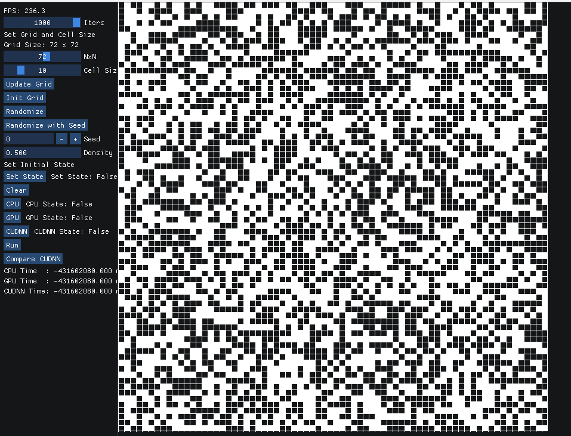
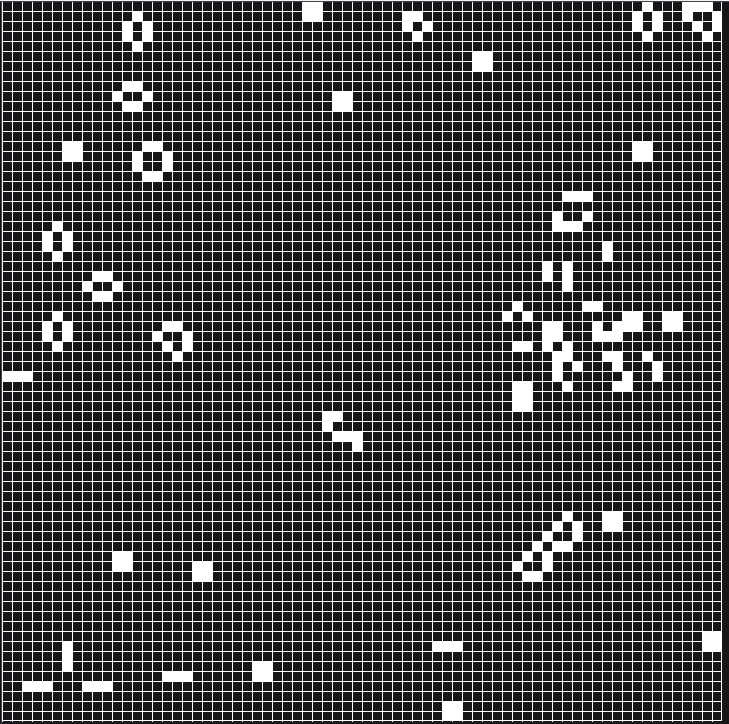
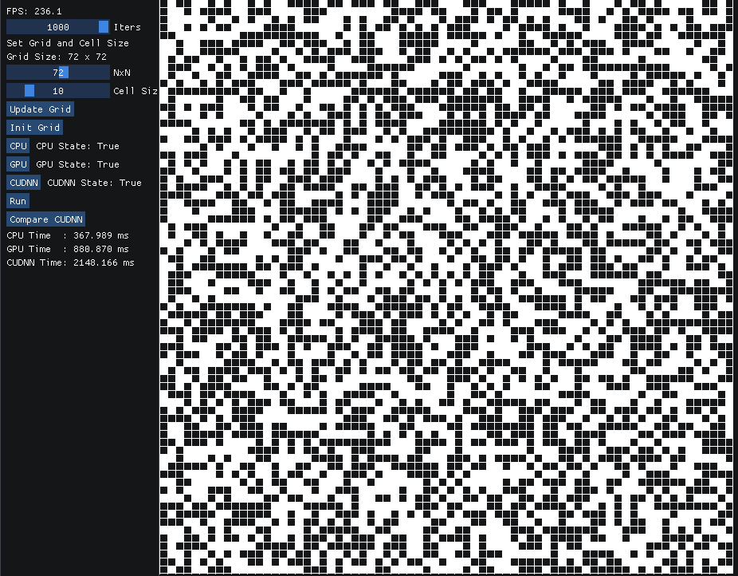
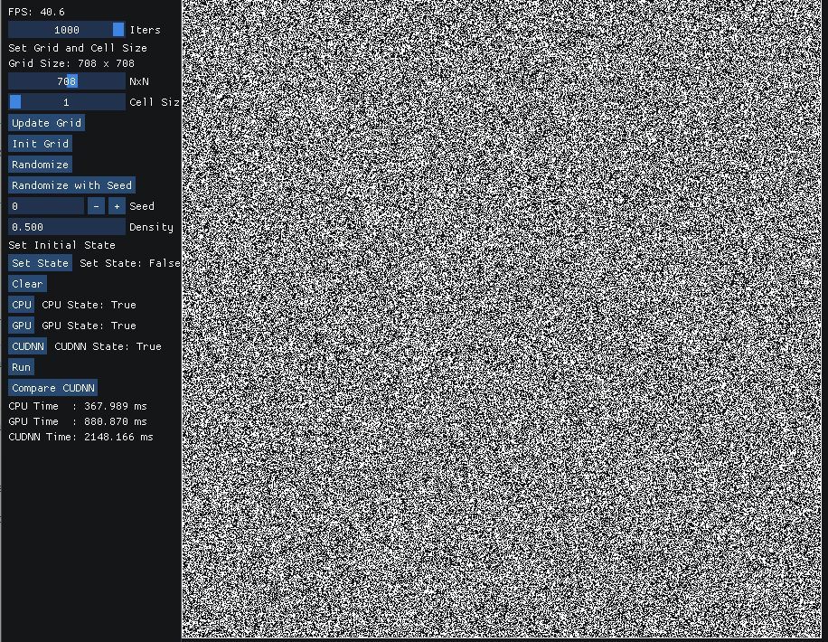
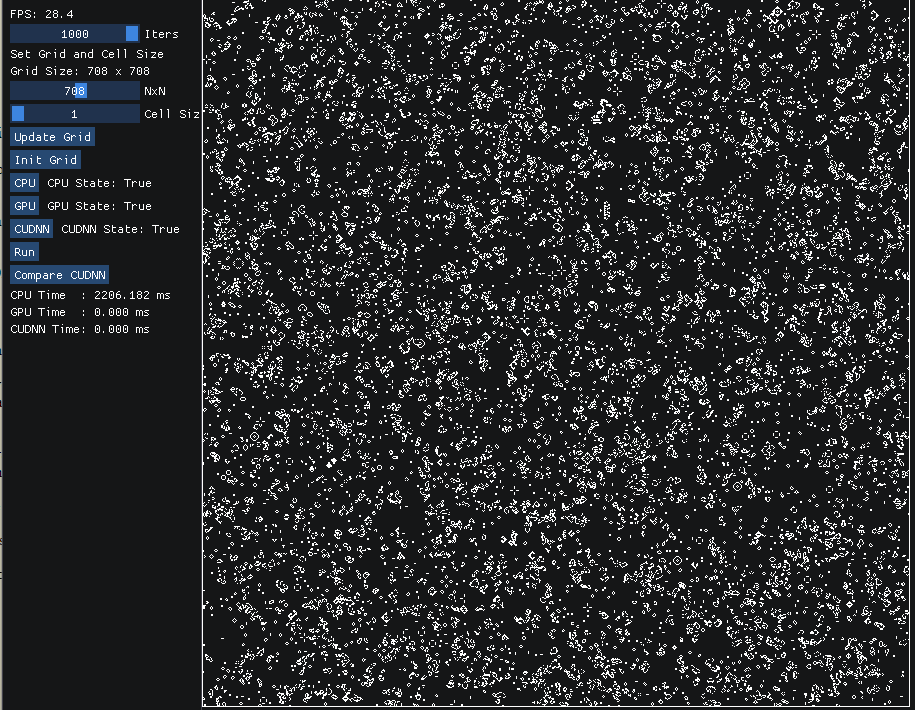
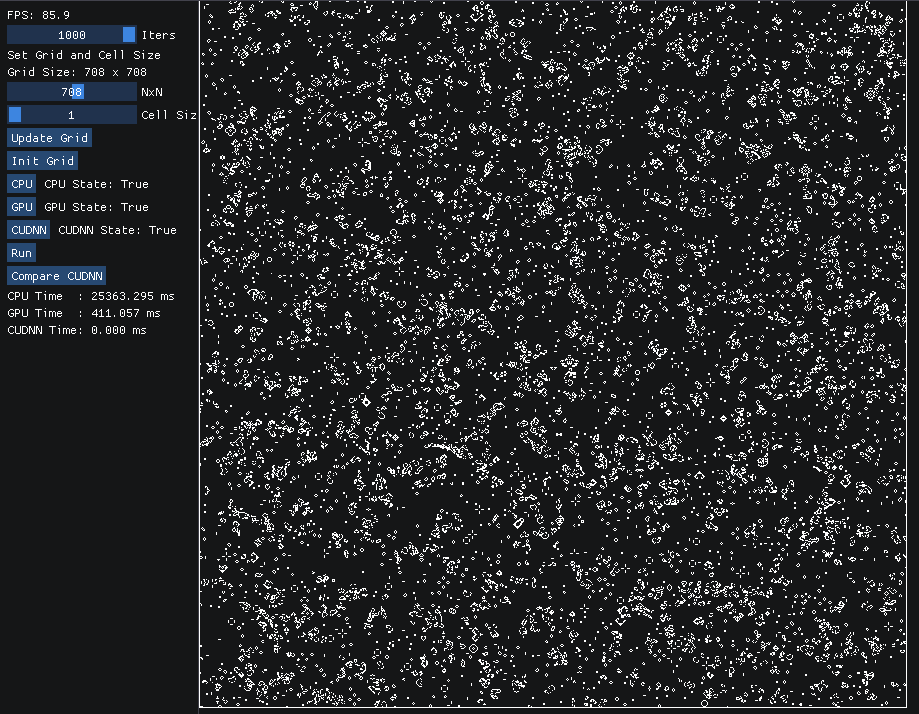
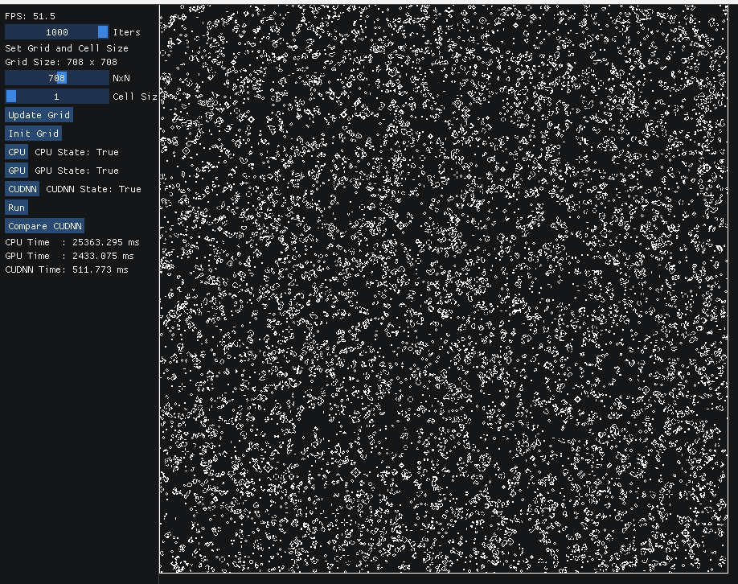
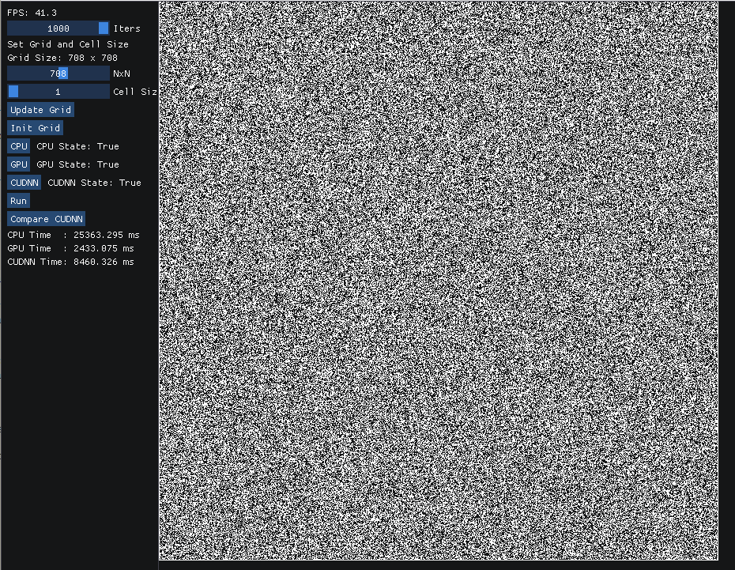

# Game of Life

## Project Description
This project is a parallel implementation of Conway's Game of Life using CUDA. The Game of Life is a cellular automaton devised by the British mathematician John Horton Conway in 1970. The game is a zero-player game, meaning that its evolution is determined by its initial state, requiring no further input. One interacts with the Game of Life by creating an initial configuration and observing how it evolves. The game is Turing complete and can simulate a universal constructor or any other Turing machine.

For our implementation, we will be using a 2D grid of cells. Each cell can be in one of two states: alive or dead. The game progresses in discrete time steps. At each time step, the following rules are applied to each cell:

1. Any live cell with fewer than two live neighbors dies, as if by underpopulation.
2. Any live cell with two or three live neighbors lives on to the next generation.
3. Any live cell with more than three live neighbors dies, as if by overpopulation.
4. Any dead cell with exactly three live neighbors becomes a live cell, as if by reproduction.

The original Game of Life is never-ending, but for our implementation, we will be running the
game for a fixed number of iterations. Additionally, the game will be played on a 
bounded grid, meaning that cells on the edge of the grid will have fewer neighbors than cells in the middle of the grid.

There are two main components to this project: the CPU implementation and the GPU implementation. The CPU implementation will be a serial implementation of the game, while the GPU implementation will be a parallel implementation using CUDA and CUDNN. The
first GPU implementation will be a custom kernel implementation, while the second GPU implementation will use CUDNN to implement the game.

The speed of the GPU implementation will be compared to the speed of the CPU implementation.
For each implementation, the overall time taken to run the game for a fixed number of iterations will be recorded. The time taken will be the sum of the time taken to 
run the update function for each cell in the grid. There will also be a
FPS counter to show the speed of the game.

## Usage Instructions

### Note
This project is built for Windows and has only been tested on Windows. The
makefile is not set up for Unix systems.

A built executable is included in the root directory. To run the executable, simply double-click on the executable. Skip to the Running the Game section for instructions on how to use the executable.

### Dependencies
- CMake
- Visual Studio 2022
- CUDA  - Download the CUDA toolkit from the NVIDIA website and install it 
- CUDNN - Download the CUDNN library from the NVIDIA website and install it
- Doxygen - Possible dependency for installing CUDNN
- Make sure to set the PATH environment variable to include the CUDA and CUDNN bin directories

### Build Instructions
1. Clone the repository
2. Within CMakeLists.txt, change the following:
    - Set the CUDNN_ROOT variable to the path of the CUDNN installation
    - Set the cuDNN_INCLUDE_DIR variable to the path of the CUDNN include directory
    - Set the cuDNN_LIBRARY_DIR variable to the path of the CUDNN library directory
3. Within CUDNN_ROOT/samples there should be a FindCUDNN.cmake file if
installed from the CUDNN library on the NVIDIA website.
3. Open a terminal and navigate to the root directory of the project
4. Run the following commands:
    ```
    mkdir build
    cd build
    cmake ..
    cmake --build . --target GameOfLife --config Debug
    ```
5. The executable will be located in the Debug directory

### Running the Game
1. Once the game is up, use the Iters slider to set the number of iterations to run the game for
2. Select the grid size using the Grid Size (NxN) slider
3. Select the cell size using the Cell Size slider
4. Click on the Update Grid button to update the grid with the selected grid size
and cell size
5. Click on the Init button to initialize the game with the following options:
    - Randomize: Randomly select cells to be alive
    - Randomize with Seed: Randomly select cells to be alive with a seed
        and the density of alive cells
    - Select Cells (Click Set State button): Manually select cells to be alive
        or dead
6. Select which implementations to run:
    - CPU: Run the CPU implementation
    - GPU: Run custom kernel GPU implementation
    - CUDNN: Run CUDNN GPU implementation
(You can select multiple implementations to run one after the other)
8. Click on Run to run the selected implementations
9. The FPS counter will show the speed of the game
10. The times will be displayed at the bottom of the menu

## Results
When small grid sizes are used, the CPU implementation is faster than the custom kernel GPU
and CUDNN GPU implementations. However, as the grid size increases, the custom kernel GPU
implementation is the fastest, followed by the CUDNN GPU implementation, and then the CPU.

### Small Grid Size Initialization
#### Grid Size: 72x72, Cell Size: 10x10, Iters: 1000, Randomize with Seed, Seed: 0, Density: 0.5


#### Running the CPU implementation with small grid sizes


#### After running all implementations with small grid sizes
##### CPU TIME: 367.989 ms, GPU TIME: 880.870 ms, CUDNN TIME: 2148.166 ms


### Large Grid Size Initialization
#### Grid Size: 708x708, Cell Size: 10x10, Iters: 1000, Randomize with Seed, Seed: 0, Density: 0.5


### Large Grid Size Results
#### Running the CPU implementation with large grid sizes


#### Running the custom kernel GPU implementation with large grid sizes


#### Running the CUDNN GPU implementation with large grid sizes


#### After running all implementations with large grid sizes
##### CPU TIME: 25363.295 ms, GPU TIME: 2433.075 ms, CUDNN TIME: 8460.326 ms


## Performance Analysis
The CPU implementation is faster than the GPU implementations when the grid size is small. This is because the overhead of copying data to the GPU and back is greater than the time taken to run the update function on the CPU. However, as the grid size increases, the custom kernel GPU implementation is faster than the CPU implementation. This is because the custom kernel GPU implementation can run the update function for each cell in parallel, while the CPU implementation runs the update function for each cell serially.

For small grid sizes (72x72), the CPU implementation is 2.39 times faster than the custom kernel GPU implementation and 9.68 times faster than the CUDNN GPU implementation. For large grid sizes (708x708), the custom kernel GPU implementation is 10.42 times faster than the CPU implementation and 2.99 times faster than the CUDNN GPU implementation.

The custom kernel GPU implementation is faster than the CUDNN GPU implementation for both
small and large grid sizes. The custom kernel GPU implementation requires less overhead then
the CUDNN GPU implementation (which requires setting up tensors and convolution descriptors).

Possible improvements to the custom kernel GPU implementation include using shared memory to reduce global memory access. With shared memory, each thread block can load a block of cells into shared memory, and then each thread in the block can access the shared memory to update the cells. This reduces the number of global memory accesses and can improve performance. The
current implementation has a single thread update a single cell. As for the CUDNN GPU implementation, the overhead of setting up tensors and convolution descriptors can be reduced by reusing them across iterations.